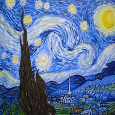
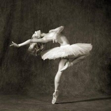
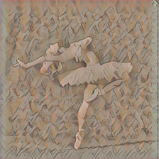
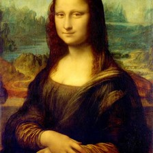
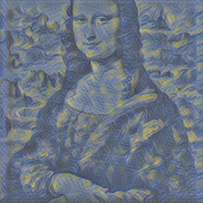
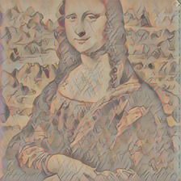

# FastStyleTransfer

Implementation of Fast Neural Style Transfer in Julia using Flux.jl

### Usage

To install this package simply run

```julia
Pkg.clone("https://github.com/avik-pal/FastStyleTransfer.jl")
```

Using it is very simple. You just need to worry about 2 functions.

The first function is `train`. You need this in case you are training on a new style. If you ever end up training on a new style please send in a PR with the model. Now the arguments you need to pass to the function are:
1. `train_data_path`: Path to the MS COCO Dataset.
2. `batch_size`
3. `η`: Learning rate. Ideally set it to `0.001`.
4. `style_image_path`
5. `epochs`
6. `model_save_path`
7. `content_weight`: The priority you want to assign to the content. A higher value leads to a better retainment of the original features.
8. `style_weight`: Same as content weight only for the style image.
9. `model`: Pass `TransformerNet` or `TransformerNet2`. You can pass a custom Network as well.
10. `images`: Total images from the COCO dataset that you want to train you model on.

The other function would be `stylize`. This will probably will be the only function most people shall use. So lets see its arguments:
1. `image_path`
2. `model_path`
3. `save_path`: Can be left blank. The image will be stored in the same directory as the image with a stylized tag.
4. `display_img`: If running from the terminal set it to `false`. Comes handy when you want to see the image without having to open the `save_path`.

Some speed statistics: The model runs quite fast taking only `5ms` to stylize a `640 x 640` image on a P100 GPU.

### Results

||||
||||
||||

### Future Work

1. Implement a GPU Kernel for Instance Normalization
2. Substitute Zero Padding for Reflection Padding
3.

### References
[1] [Perceptual Losses for Real-Time Style Transfer and Super-Resolution](https://cs.stanford.edu/people/jcjohns/eccv16/)
[2] [A Neural Algorithm of Artistic Style](https://arxiv.org/abs/1508.06576)
[3] [Instance Normalization: The Missing Ingredient for Fast Stylization](https://arxiv.org/abs/1607.08022)

If you are interested in the implementation look up [this blog post](https://avik-pal.github.io/blog/2018-07-07-Implementing_Fast_Neural_Style_Transfer_in_Flux/).
